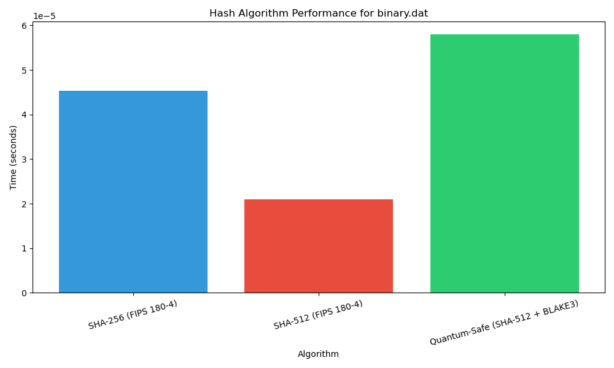
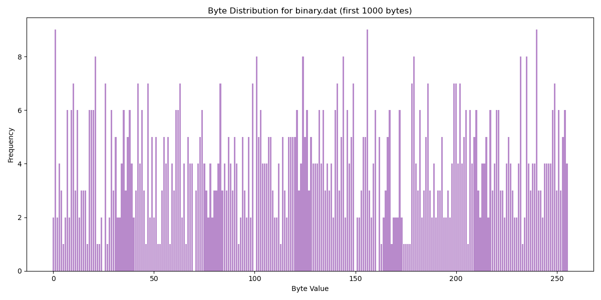
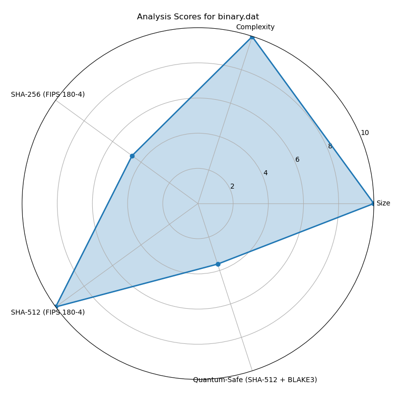

# Visual Analysis Report

Generated on: 2025-04-25 13:31:14

## binary.dat

### Performance Comparison

### Byte Distribution

### Hash Bit Patterns

#### SHA-256 (FIPS 180-4)

_bits.png)

#### SHA-512 (FIPS 180-4)

_bits.png)

#### Quantum-Safe (SHA-512 + BLAKE3)

_bits.png)

### Analysis Scores

| Metric | Score (0-10) |
|--------|-------------|
| File Size | 10.00 |
| Complexity | 9.98 |
| SHA-256 (FIPS 180-4) Speed | 4.63 |
| SHA-512 (FIPS 180-4) Speed | 10.00 |
| Quantum-Safe (SHA-512 + BLAKE3) Speed | 3.62 |

